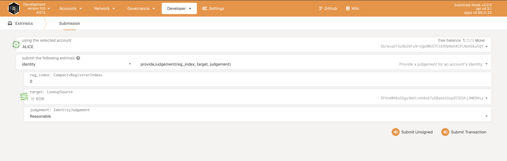

### Deploy local chain

1. clone the repo: `git clone https://github.com/OAK-Foundation/substrate-node-template.git`
2. git checkout grant_round branch: `git checkout grant_round`
3. build with `cargo build --release`
4. start two nodes(Alice and Bob):

	```
	// Start Alice node:
	./target/release/node-template \
	--chain ./customSpecRaw.json \
	--alice \
  	--port 30333 \
  	--ws-port 9944 \
  	--rpc-port 9933 \
  	--node-key 0000000000000000000000000000000000000000000000000000000000000001 \
  	--validator \
	--tmp
	
	// Bob join to Alice node
	// 12D3KooWEyoppNCUx8Yx66oV9fJnriXwCcXwDDUA2kj6vnc6iDEp is Alice node identity
	./target/release/node-template \
	--chain customSpecRaw.json \
  	--bob \
  	--port 30334 \
  	--ws-port 9945 \
  	--rpc-port 9934 \
  	--validator \
  	--bootnodes /ip4/127.0.0.1/tcp/30333/p2p/12D3KooWEyoppNCUx8Yx66oV9fJnriXwCcXwDDUA2kj6vnc6iDEp \
	--tmp
	```

### How to test

1. Install dependencies: `yarn`
2. Run all test cases: `npm test`
3. Run all Unit Test cases: `npm test unit`
4. Run all Functional Test cases: `npm test functional`

### Manual Test

##### Identity Test

1. Start local node

	```
	git checkout check_identity
	./target/release/node-template --dev --tmp
	```

2. Config the webapps' setting: Open browser with url "https://polkadot.js.org/apps/", Settings -> Developer, paste the below json code, then save.

	```
	{
	  "ProjectIndex": "u32",
	  "ProjectOf": "Project",
	  "RoundIndex": "u32",
	  "RoundOf": "Round",
	  "Round": {
	    "start": "BlockNumber",
	    "end": "BlockNumber",
	    "matching_fund": "Balance",
	    "grants": "Vec<Grant>",
	    "funder": "AccountId"
	  },
	  "Grant": {
	    "project_index": "ProjectIndex",
	    "contributions": "Vec<Contribution>",
	    "is_allowed_withdraw": "bool",
	    "is_canceled": "bool",
	    "is_withdrawn": "bool"
	  },
	  "Contribution": {
	    "account_id": "AccountId",
	    "value": "Balance"
	  },
	  "Project": {
	    "name": "Vec<u8>",
	    "logo": "Vec<u8>",
	    "description": "Vec<u8>",
	    "website": "Vec<u8>",
	    "owner": "AccountId"
	  }
	}
	```
	
3. Add identity registrar

	Developer -> Sudo, here we use the Sudo account to set Alice to be registrar
	
	
	
	Then sign and submit transaction
	
4. Bob set identity

	Click the "Set on-chain identity"
	
	
	
	Input identity information
	
	
	
	Then sign and submit transaction, we can get the Bob identity status
	
	
	
5. Bob request Alice to judgement

	Developer -> Extrinsics, here we select Bob to request judgement.
	
	reg_index is the Registrar Index. Alice registrar index is 0 because Alice is the first registrar.
	
      max_fee with 100 Unit (means that the maximum fee Bob can pay is 100 Unit).
	
	
	
	Then sign and submit.
	
6. Alice provide judgement

	Developer -> Extrinsics, here we use Alice to provide the Bob's judgement
	
	Seven types can select：
	
	1. Unknown: The default value, no judgement made yet.
	2. Reasonable: The data appears reasonable, but no in-depth checks (e.g. formal KYC process) were 	performed.
	3. Known Good: The registrar has certified that the information is correct.
	4. Out of Date: The information used to be good, but is now out of date.
	5. Low Quality: The information is low quality or imprecise, but can be fixed with an update.
	6. Erroneous: The information is erroneous and may indicate malicious intent.
	7. FeePaid: Is for when a user has requested judgement and it is in progress
	
	
	
	Information that is in "FeePaid" or "Erroneous" is "sticky" and cannot be modified; it can only be removed by complete removal of the identity.
	
	1. Set to Unknown:
	
		
		
		Then sign and submit, we can get Bob's identity with "Unknown" status.
		
		
	
	2. Set to Reasonable:
	
		
		
		Then sign and submit, we can get Bob's identity with "Reasonable" status.
		
		
		
	3. Set to Known Good：

		
		
		Then sign and submit, we can get Bob's identity with "Known Good" status.
		
		
	
	4. Set to Out of Date:

		
		
		Then sign and submit, we can get Bob's identity with "Out of Date" status.
		
		
		
	5. Set to Low Quality:

		
		
		Then sign and submit, we can get Bob's identity with "Low Quality" status.
		
		
		
	6. Set to Erroneous:

		
		
		Then sign and submit, we can get Bob's identity with "Erroneous" status.
		
		
		
7. Bob request an error Registrar Index will cause error

	
	
8. Bob request Alice to judgement twice will cause error

	 
		
9. Alice input the error Registrar Index will cause error

	
		
10. Others to provide the judgement will cause error

	
	
	